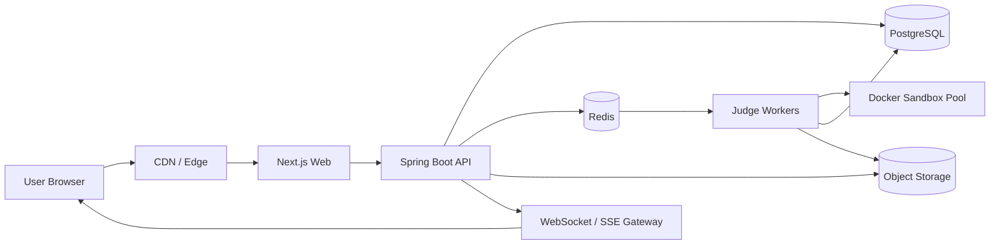

# NimbleJudge Architecture Blueprint

## Product Goal

Build a world-class competitive programming platform that combines the contest intensity of Codeforces, the practice quality of LeetCode, the precision of AtCoder, the education surface of HackerRank, and the editor quality of VS Code.

## Architecture Principles

- UI/UX first: ship a premium, fast, dark-first interface before expanding backend depth.
- Clean architecture: domain logic is isolated from transport, storage, and framework details.
- Secure by default: every execution path treats user code as hostile.
- Scalable by queue: submissions are accepted quickly, judged asynchronously, and reported through live updates.
- Observable systems: every judge result, queue delay, auth event, and API latency is measurable.

## Repository Structure

```text
apps/
  web/                         # Next.js frontend in a future monorepo split
  api/                         # Spring Boot API
  judge-worker/                # Spring Boot or JVM worker service
packages/
  ui/                          # Shared design system components
  editor/                      # Monaco editor module
  contracts/                   # OpenAPI schemas and generated clients
infra/
  docker/
  kubernetes/
  terraform/
docs/
  architecture-blueprint.md
  design-system.md
  database-design.md
src/                           # Current Next.js implementation
```

The current implementation keeps the Next.js app at `src/` for fast iteration. When backend work begins, move to the monorepo layout above without changing domain boundaries.

## Service Boundaries

### Web App

- Stack: Next.js, TypeScript, TailwindCSS, Framer Motion, Monaco Editor.
- Responsibilities: landing page, problem browser, editor workspace, contest scoreboard, analytics dashboard, admin authoring UI.
- Does not own business rules for judging, ratings, or contest scoring.

### API Service

- Stack: Spring Boot, Spring Security, PostgreSQL, Redis.
- Responsibilities: authentication, users, problems, contests, submissions, discussions, ratings, notifications.
- Exposes REST APIs initially, with WebSocket/SSE for live verdict and scoreboard events.

### Judge Orchestrator

- Accepts submission jobs from Redis.
- Resolves language runtime, problem test cases, and limits.
- Delegates execution to sandbox workers.
- Writes normalized verdicts and emits events.

### Sandbox Worker

- Runs code in Docker with strict limits.
- No network access.
- Read-only root filesystem where possible.
- Per-run CPU, memory, process, file size, and timeout limits.
- Emits compile logs, runtime logs, and per-test metrics.

### AI Service

- Optional separate service to protect core judge reliability.
- Handles hints, complexity analysis, code review, and recommendations.
- Never receives hidden test cases.

## Frontend Routes

| Route | Purpose |
| --- | --- |
| `/` | Landing page |
| `/problems` | Problemset search and filters |
| `/problems/[slug]` | Problem statement and submit workspace |
| `/contests` | Contest listing |
| `/contests/[slug]` | Contest home |
| `/contests/[slug]/standings` | Live scoreboard |
| `/submissions/[id]` | Submission details |
| `/dashboard` | User analytics |
| `/admin/problems` | Problem authoring |

## API Structure

```text
/api/v1/auth/signup
/api/v1/auth/login
/api/v1/auth/refresh
/api/v1/auth/logout
/api/v1/auth/verify-email
/api/v1/auth/oauth/{provider}

/api/v1/users/me
/api/v1/users/{handle}
/api/v1/users/{handle}/stats

/api/v1/problems
/api/v1/problems/{slug}
/api/v1/problems/{slug}/editorial
/api/v1/problems/{slug}/discussions

/api/v1/submissions
/api/v1/submissions/{id}
/api/v1/submissions/{id}/events

/api/v1/contests
/api/v1/contests/{slug}
/api/v1/contests/{slug}/register
/api/v1/contests/{slug}/standings

/api/v1/admin/problems
/api/v1/admin/test-cases
```

## Submission Flow

1. User submits code from the editor.
2. API validates language, problem visibility, contest rules, and rate limits.
3. API stores source code in object storage and creates a `QUEUED` submission.
4. API pushes a Redis job with submission ID and execution metadata.
5. Judge worker leases job with visibility timeout.
6. Worker compiles code in Docker if needed.
7. Worker executes against public or hidden tests with limits.
8. Worker writes per-test results and final verdict.
9. API emits verdict event through SSE/WebSocket.
10. Contest scoreboard and analytics projections update asynchronously.

## Verdicts

- `AC`: accepted.
- `WA`: wrong answer.
- `TLE`: time limit exceeded.
- `MLE`: memory limit exceeded.
- `RE`: runtime error.
- `CE`: compile error.

Every verdict is deterministic, auditable, and tied to execution metrics.

## Contest Engine

- Contest membership is stored separately from global users.
- Scoreboard projections are recalculated from accepted submissions and penalties.
- Freeze mode hides submissions after `freeze_at` from public standings while preserving admin visibility.
- Virtual contests use shifted contest windows per participant.
- Team contests support shared membership and one standing row per team.

## Rating System

Use a Codeforces-like model:

- Estimate participant rank from pairwise expected performance.
- Convert actual rank to performance rating.
- Apply damped rating delta based on contest count and volatility.
- Store old rating, new rating, delta, rank, and performance in `ratings`.

## Security Architecture

### Authentication

- Short-lived JWT access tokens.
- Rotating refresh tokens stored hashed server-side.
- Email verification before privileged actions.
- OAuth through Google and GitHub.
- Rate-limited login, signup, password reset, and submission endpoints.

### Authorization

- Role-based access control: `USER`, `AUTHOR`, `ADMIN`.
- Resource-level checks for private contests and draft problems.
- Audit logs for admin actions.

### Judge Sandbox

- Docker containers run as non-root.
- Disable network.
- Limit CPU, memory, pids, output size, and wall-clock time.
- Mount source and test files read-only where possible.
- Destroy container after each run.
- Do not expose host Docker socket to application containers.

### Data Protection

- Hash passwords with Argon2id or BCrypt with strong cost.
- Store refresh tokens hashed.
- Encrypt secrets through environment manager or secret store.
- Keep hidden tests outside frontend-accessible storage.
- Validate all markdown rendering through sanitizer.

## Deployment Architecture



## Observability

- API metrics: request latency, error rate, auth failures, submission creation rate.
- Judge metrics: queue delay, compile time, run time, memory usage, verdict distribution.
- Contest metrics: scoreboard update time, event fanout delay.
- Logs: structured JSON with correlation IDs.
- Traces: connect submission request to judge worker lifecycle.

## Production Readiness Checklist

- Threat model judge sandbox before public launch.
- Add integration tests for auth, problem visibility, contest scoring, and judging.
- Add load tests for submission bursts and scoreboard updates.
- Add accessibility QA on editor workspace and problem pages.
- Add disaster recovery for PostgreSQL and object storage.
- Add moderation tools for discussions and problem content.
