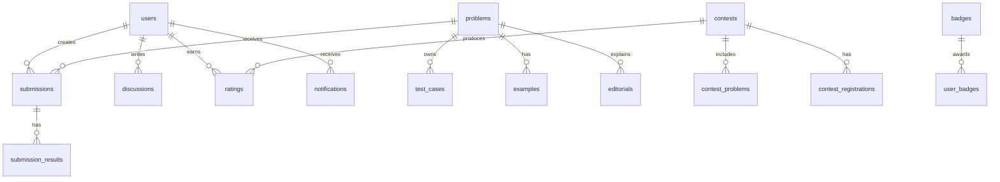

# Database Design

## Core Entities

The PostgreSQL model is normalized around identity, content, contests, judging, and learning signals.

## Tables

### `users`

| Column | Type | Notes |
| --- | --- | --- |
| `id` | `uuid` | Primary key |
| `handle` | `varchar(32)` | Unique, public |
| `email` | `citext` | Unique |
| `password_hash` | `text` | Nullable for OAuth-only accounts |
| `avatar_url` | `text` | Optional |
| `role` | `user_role` | `USER`, `AUTHOR`, `ADMIN` |
| `email_verified_at` | `timestamptz` | Optional |
| `created_at` | `timestamptz` | Required |
| `updated_at` | `timestamptz` | Required |

### `problems`

| Column | Type | Notes |
| --- | --- | --- |
| `id` | `uuid` | Primary key |
| `slug` | `varchar(120)` | Unique |
| `title` | `varchar(180)` | Required |
| `difficulty` | `problem_difficulty` | `EASY`, `MEDIUM`, `HARD`, `EXPERT` |
| `statement_md` | `text` | Required |
| `constraints_md` | `text` | Required |
| `author_id` | `uuid` | FK users |
| `visibility` | `problem_visibility` | `DRAFT`, `PRIVATE`, `PUBLIC` |
| `time_limit_ms` | `integer` | Required |
| `memory_limit_mb` | `integer` | Required |
| `created_at` | `timestamptz` | Required |

### `test_cases`

| Column | Type | Notes |
| --- | --- | --- |
| `id` | `uuid` | Primary key |
| `problem_id` | `uuid` | FK problems |
| `input_blob_key` | `text` | Object storage key |
| `output_blob_key` | `text` | Object storage key |
| `is_hidden` | `boolean` | Required |
| `weight` | `integer` | Defaults to 1 |
| `ordinal` | `integer` | Stable order |

### `contests`

| Column | Type | Notes |
| --- | --- | --- |
| `id` | `uuid` | Primary key |
| `slug` | `varchar(120)` | Unique |
| `name` | `varchar(180)` | Required |
| `type` | `contest_type` | `RATED`, `VIRTUAL`, `PRIVATE`, `TEAM` |
| `starts_at` | `timestamptz` | Required |
| `ends_at` | `timestamptz` | Required |
| `freeze_at` | `timestamptz` | Optional |
| `created_by` | `uuid` | FK users |

### `submissions`

| Column | Type | Notes |
| --- | --- | --- |
| `id` | `uuid` | Primary key |
| `user_id` | `uuid` | FK users |
| `problem_id` | `uuid` | FK problems |
| `contest_id` | `uuid` | Nullable |
| `language` | `language` | `C`, `CPP`, `JAVA`, `PYTHON`, `JAVASCRIPT` |
| `source_blob_key` | `text` | Object storage key |
| `verdict` | `verdict` | `QUEUED`, `AC`, `WA`, `TLE`, `MLE`, `RE`, `CE` |
| `runtime_ms` | `integer` | Nullable |
| `memory_kb` | `integer` | Nullable |
| `submitted_at` | `timestamptz` | Required |

### Supporting Tables

- `submission_results`: per-test verdict, runtime, memory, stderr summary.
- `examples`: public sample input/output for problem pages.
- `editorials`: markdown explanation, author, publication status.
- `discussions`: threaded comments linked to problem or contest.
- `ratings`: contest performance, old rating, new rating, delta.
- `badges` and `user_badges`: achievements and awards.
- `notifications`: typed inbox events.
- `oauth_accounts`: provider identity links.
- `refresh_tokens`: hashed refresh token rotation records.
- `audit_logs`: admin and security-sensitive actions.

## Index Strategy

- `users(handle)` unique.
- `users(email)` unique.
- `problems(slug)` unique.
- `problems(visibility, difficulty, created_at desc)`.
- `problem_tags(problem_id, tag_id)` and `problem_tags(tag_id, problem_id)`.
- `submissions(user_id, submitted_at desc)`.
- `submissions(problem_id, verdict, submitted_at desc)`.
- `submissions(contest_id, user_id, problem_id, submitted_at)`.
- `contest_registrations(contest_id, user_id)` unique.
- `ratings(user_id, created_at desc)`.
- `notifications(user_id, read_at, created_at desc)`.

## Scaling Notes

- Store source code, test input, and expected output in object storage, not directly in PostgreSQL.
- Partition `submissions` by month after traffic growth.
- Use materialized scoreboard snapshots during live contests.
- Keep verdict aggregation idempotent so judge workers can retry safely.
